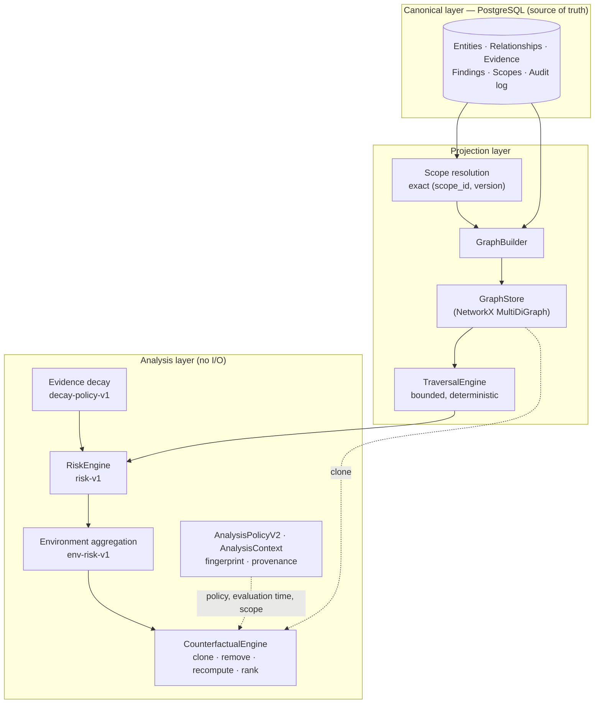

# AttackGraph

Evidence-driven attack-path and security-risk analysis for **authorized environments**.

AttackGraph models an environment you are authorized to assess as a typed security graph and
answers a defensive question:

> *What can reach what, through which relationships, on what evidence, how dangerous is it,
> and which defensive change reduces that risk?*

It is an analysis platform. It does not scan, probe, exploit, or act on any environment; it
reasons over facts that have been imported into it.

> **Status:** early-stage research software under active development (version `0.1.0`, no
> releases yet). Interfaces and data formats may change. See [Project status](#project-status).

---

## Contents

- [Core model](#core-model)
- [Canonical truth vs. derived analysis](#canonical-truth-vs-derived-analysis)
- [Architecture](#architecture)
- [Quick start](#quick-start)
- [Development and testing](#development-and-testing)
- [Documentation](#documentation)
- [Project status](#project-status)
- [Known limitations](#known-limitations)
- [Roadmap](#roadmap)
- [Contributing](#contributing)
- [Security](#security)
- [License](#license)

---

## Core model

```
Assets → Relationships → Evidence → Findings → Attack Paths → Risk → Remediation
```

| Stage | Meaning |
|---|---|
| **Assets** | Security-relevant entities: the internet, domains, IPs, hosts, servers, workstations, containers, cloud resources, applications, APIs, databases, users, service accounts, groups, roles, repositories, network segments. |
| **Relationships** | Directed, typed edges between assets, e.g. `EXPOSES`, `ROUTES_TO`, `CAN_AUTHENTICATE_TO`, `RUNS_AS`, `HAS_PERMISSION_ON`, `MEMBER_OF`, `CAN_ASSUME`, `DEPENDS_ON`, `STORES`, `TRUSTS`, `COMMUNICATES_WITH`. Parallel edges are distinct objects. Reachability is not the same as authority. |
| **Evidence** | Why a relationship is believed: source, source type, collection and import time, confidence, freshness TTL, raw reference. Evidence is append-only and never mutated. |
| **Findings** | Vulnerabilities or misconfigurations attached to assets. Findings are relational inputs to risk, not graph nodes. |
| **Attack paths** | Bounded, deterministic paths from a source to a target, identified by ordered entity and relationship IDs. |
| **Risk** | Versioned, deterministic scores (`risk-v1` per path, `env-risk-v1` aggregate) that always ship with a factor breakdown. |
| **Remediation** | Counterfactual analysis: remove one relationship from a clone of the projection, recompute, and rank candidates by risk reduction. |

Relationships carry a **truth tier**: `OBSERVED` (a source asserted it) or `INFERRED` (derived by
an explicit rule). Analytical conclusions are a third, non-persistable tier and can never be
stored as relationships.

## Canonical truth vs. derived analysis

AttackGraph keeps a hard boundary between facts and computations:

| Canonical (persisted in PostgreSQL) | Derived (computed, disposable) |
|---|---|
| Entities, relationships, evidence, findings | Graph projection |
| Scope definitions (immutable, versioned) | Attack paths and path identities |
| Audit log | Risk scores and breakdowns, environment risk |
| | Overlap metrics, counterfactual rankings |

- The graph projection is always rebuildable from PostgreSQL; no fact exists only in the graph.
- Analytical output is never written back as canonical data.
- Every analytical computation is deterministic: explicit, timezone-aware evaluation time; no
  wall-clock reads; total ordering of results; versioned formulas; policy fingerprints.

The full rules are in [Architecture rules](docs/architecture/ARCHITECTURE_RULES.md) and
[Analytical integrity rules](docs/analytics/ANALYTICAL_INTEGRITY_RULES.md).

## Architecture



- **Dependency direction is one-way** (analysis → projection → canonical → domain). Analysis
  code never touches NetworkX directly; it uses `GraphStore` and `TraversalEngine`.
- **Traversal has two distinct bounds:** `max_hops` (computational safety) and
  `traversal_budget` (modelled attacker effort), plus `max_paths`. Hitting `max_paths` is
  reported as saturation, not as a complete result.
- **Scope:** a persisted `ScopeDefinition` is resolved by exact version into an
  `AnalyticalScope`. In v1 the analytical graph is always universal (`UNIVERSAL` / `ALL`), so
  paths that originate outside a reporting area are never silently dropped.
- **Engine identity:** the container records a source-tree digest of the delivered files, a
  dependency digest and a substrate digest. Only a clean, traceable, hardened build is
  considered verified — a precondition for the planned persistence of analytical results.

Repository layout:

```
backend/
  app/
    domain/      ORM models and enums (canonical schema)
    storage/     database session, repositories, projection queries
    graph/       GraphStore, NetworkX store, GraphBuilder, TraversalEngine, scope resolution
    analytics/   risk, aggregation, decay, counterfactual, policy, context, engine identity
    schemas/     Pydantic schemas for canonical input and analytical results
    main.py      FastAPI app (currently a /health endpoint only)
  alembic/       database migrations
  scripts/       engine metadata generation, synthetic data loader
  tests/         unit tests and PostgreSQL integration tests
docs/            engineering governance (see Documentation)
```

## Quick start

Prerequisites: Docker (for PostgreSQL 16), Python 3.12+, and a POSIX shell (Linux, macOS,
WSL or Git Bash) for the commands below.

```bash
git clone https://github.com/WiseHax/AttackGraph.git
cd AttackGraph

# 1. Configure the environment, then edit .env and set real values for
#    POSTGRES_PASSWORD and SECRET_KEY (never commit .env)
cp .env.example .env

# 2. Start PostgreSQL. On first start the container also creates the
#    separate <POSTGRES_DB>_test database used by integration tests.
docker compose up -d postgres

# 3. Install backend dependencies
cd backend
python -m pip install -r requirements.txt

# 4. Apply migrations. Alembic reads DATABASE_URL from the environment,
#    so export the values from .env first.
set -a && . ../.env && set +a
alembic upgrade head
```

The FastAPI application currently exposes only a health check:

```bash
uvicorn app.main:app --reload     # GET http://127.0.0.1:8000/health
```

There is no analytical HTTP API yet; the engines are used as a Python library (see the
integration tests for end-to-end examples).

## Development and testing

All commands run from `backend/`.

```bash
# Unit tests only (no database needed; integration tests skip themselves)
python -m pytest

# Full suite including PostgreSQL integration tests
set -a && . ../.env && set +a        # provides TEST_DATABASE_URL
python -m pytest
```

> **Warning:** the integration test fixture runs `DROP SCHEMA public CASCADE` on the database
> named by `TEST_DATABASE_URL` before migrating it. Point it **only** at a dedicated test
> database (the default `.env.example` value targets `<POSTGRES_DB>_test`), never at a database
> whose contents you need.

Testing expectations are part of the engineering governance: invariant, golden, determinism
and negative tests are a specification, and a test is never weakened to make it pass. See
[Testing and verification](docs/testing/TESTING_AND_VERIFICATION.md).

The Docker image installs dependencies from the hash-pinned `requirements.lock`, runs as an
unprivileged user, and generates read-only engine metadata at build time (see
[`backend/Dockerfile`](backend/Dockerfile)).

## Documentation

| Document | Covers |
|---|---|
| [AGENTS.md](AGENTS.md) | Entry point, source-of-truth hierarchy, STOP conditions |
| [Architecture rules](docs/architecture/ARCHITECTURE_RULES.md) | Layering, canonical vs. derived, bounds, identity, open questions |
| [Analytical integrity rules](docs/analytics/ANALYTICAL_INTEGRITY_RULES.md) | Truth tiers, determinism, versioning, fingerprints, saturation |
| [Security engineering rules](docs/security/SECURITY_ENGINEERING_RULES.md) | Threat model, secrets, untrusted input, supply chain, engine identity |
| [Testing and verification](docs/testing/TESTING_AND_VERIFICATION.md) | Test taxonomy, golden fixtures, prohibited test edits |
| [Code standards](docs/engineering/CODE_STANDARDS.md) | Determinism in code, dependencies, structure |
| [Definition of done](docs/engineering/DEFINITION_OF_DONE.md) | The gate every change must pass |
| [AI engineering playbook](docs/engineering/AI_ENGINEERING_PLAYBOOK.md) | Workflow for AI coding agents |
| [Identity and time](backend/docs/identity_and_time.md) | Path identity, evidence supersession, evaluation time |
| [Changelog](CHANGELOG.md) | Notable changes |

## Project status

AttackGraph is developed in phases. Current state:

- **Complete:** canonical relational model; graph projection; bounded traversal; `risk-v1`;
  counterfactual remediation ranking; analytical integrity and security posture; policy
  fingerprints and comparability; reproducible engine identity; versioned scope foundation.
- **In progress:** hardening required before persisting historical analytical results
  (Phase 7B). Completed so far: deterministic counterfactual output, fail-closed
  counterfactual behaviour, truthful analysis policy (`AnalysisPolicyV2`), exact-version scope
  resolution, explicit UTC evaluation-time provenance, hardened engine identity and delivered
  source identity. Remaining: saturation semantics and policy-driven traversal for
  counterfactual analysis.
- **Not implemented:** persistence of analytical results or snapshots, an analytical HTTP API,
  authentication, connectors/importers.

## Known limitations

Disclosed per the [analytical integrity rules](docs/analytics/ANALYTICAL_INTEGRITY_RULES.md):

- `env-risk-v1` does not correct for path overlap, so correlated paths can be double counted;
  environment risk may rise with graph density. It is a comparative score, not a probability.
- Risk weights, traversal costs and decay parameters are structurally defined but **not
  empirically calibrated**.
- Enumeration is bounded: a saturated path set is a lower bound, and counterfactual results
  do not yet propagate saturation state.
- Counterfactual *deltas* under one fixed policy are more defensible than absolute risk levels.

## Roadmap

Documented direction (not commitments; each requires a separately authorized phase — see
[Architecture rules §11](docs/architecture/ARCHITECTURE_RULES.md)):

1. Complete pre-7B hardening: counterfactual saturation semantics and policy-driven traversal.
2. Phase 7B: persisted analytical artefacts bound to snapshots, with reproducible provenance.
3. Snapshot comparison, posture drift and risk-change attribution.

AttackGraph will not become an exploitation tool, an autonomous agent acting on environments,
a generic vulnerability scanner, or an ML-based risk scorer
([AGENTS.md §2](AGENTS.md)).

## Contributing

Contributions are welcome. Please read [CONTRIBUTING.md](CONTRIBUTING.md) first: changes
follow a documented engineering workflow, must keep analysis deterministic, and must not
weaken tests or governance rules. Participation is governed by the
[Code of Conduct](CODE_OF_CONDUCT.md).

## Security

AttackGraph is for **authorized, defensive** use only. To report a vulnerability, follow
[SECURITY.md](SECURITY.md) — do not disclose vulnerability details in public issues.

## License

AttackGraph is licensed under the [MIT License](LICENSE).
