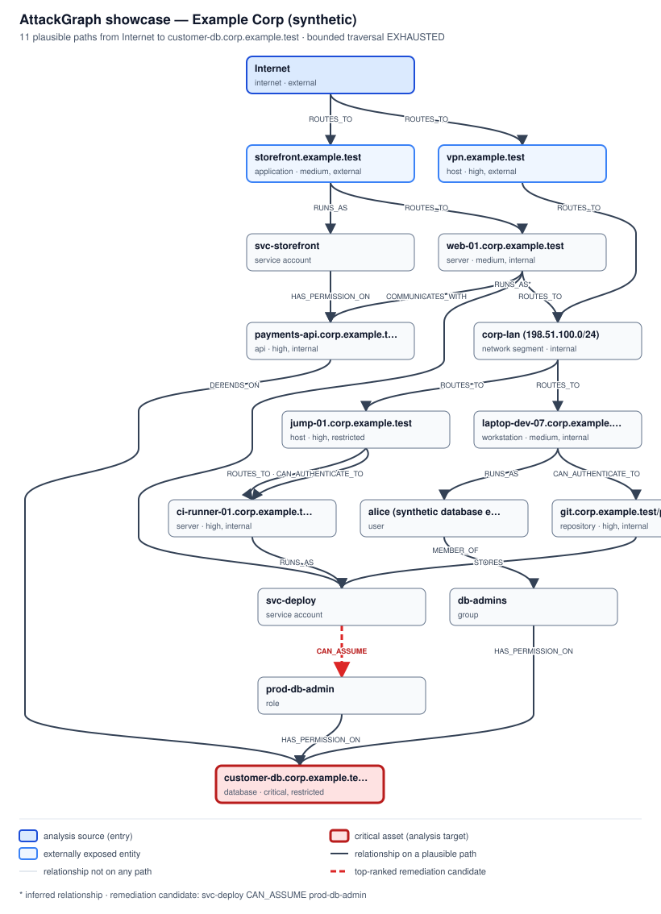

# AttackGraph — Security Analysis Report

> Synthetic demonstration. AttackGraph analyses a model of an authorized environment; it does not scan, probe or exploit anything. Attack paths are plausible paths under the model and the policy's bounds, not confirmed attacks. Risk values are comparative analytical scores under versioned formulas, not probabilities of compromise.

- **Environment: **Example Corp \(synthetic\)
- **Evaluation time: **`2026-01-15T12:00:00Z`
- **Policy: **`analysis-policy-v2` · fingerprint `74b28bf025e5c693…`
- **Scope: **Example Corp showcase \(synthetic\) `08f35593-3ef8-5c08-8aaf-c61a7582f3f8 v1`
- **Engine identity: **`ENGINE_UNVERIFIABLE(missing_metadata)`

## Executive summary

- The model contains 16 entities, 22 relationships \(21 observed, 1 inferred\), 17 evidence records and 5 findings.
- Bounded traversal from **Internet** to the critical asset **customer-db.corp.example.test** found **11 plausible paths** and terminated `EXHAUSTED` \(not saturated: every path within the policy's bounds was enumerated\).
- Highest path risk **0.8820** \(CRITICAL\); environment risk \(env-risk-v1\) **0.99999983**.
- Counterfactual analysis ranks removing **svc-deploy —CAN\_ASSUME→ prod-db-admin** first: it removes **7 of 11 paths**, the highest remaining path risk is **0.7145** \(HIGH\) and environment risk becomes **0.98881069**.
- Equivalent candidate\(s\) with the identical effect: prod-db-admin —HAS\_PERMISSION\_ON→ customer-db.corp.example.test.
- The ranking is **persistence-authoritative**; engine identity is `ENGINE_UNVERIFIABLE(missing_metadata)`, so the persistence preconditions are **not met** \(persistence itself is not implemented\).

## Environment overview

Example Corp \(synthetic\): 16 entities connected by 22 directed, typed relationships. Traversal follows the stored direction of each relationship. The graph below is rendered from the analysed projection.



| Entity | Type | Criticality | Exposure | Findings |
|---|---|---|---|---|
| payments-api.corp.example.test | API | HIGH | INTERNAL | — |
| storefront.example.test | APPLICATION | MEDIUM | EXTERNAL | 1 |
| customer-db.corp.example.test | DATABASE | CRITICAL | RESTRICTED | 1 |
| db-admins | GROUP | — | — | — |
| jump-01.corp.example.test | HOST | HIGH | RESTRICTED | 1 |
| vpn.example.test | HOST | HIGH | EXTERNAL | — |
| Internet | INTERNET | — | EXTERNAL | — |
| corp-lan \(198.51.100.0/24\) | NETWORK\_SEGMENT | — | INTERNAL | — |
| git.corp.example.test/platform/deploy | REPOSITORY | HIGH | INTERNAL | — |
| prod-db-admin | ROLE | — | — | — |
| ci-runner-01.corp.example.test | SERVER | HIGH | INTERNAL | 1 |
| web-01.corp.example.test | SERVER | MEDIUM | INTERNAL | 1 |
| svc-deploy | SERVICE\_ACCOUNT | — | — | — |
| svc-storefront | SERVICE\_ACCOUNT | — | — | — |
| alice \(synthetic database engineer\) | USER | — | — | — |
| laptop-dev-07.corp.example.test | WORKSTATION | MEDIUM | INTERNAL | — |

## Critical assets

- **customer-db.corp.example.test** \(DATABASE\) — Production database holding \(fictional\) customer records.

## Attack surface

Entities with EXTERNAL exposure, and the relationships through which the analysis source reaches them:

- **Internet** \(INTERNET\) — reached via the analysis source itself
- **vpn.example.test** \(HOST\) — reached via Internet —ROUTES\_TO→ vpn.example.test
- **storefront.example.test** \(APPLICATION\) — reached via Internet —ROUTES\_TO→ storefront.example.test

## Attack paths

11 plausible paths under the model, ordered by risk-v1 score. Each path has a deterministic identity \(a hash of its ordered entity and relationship IDs\), so parallel relationships produce distinct paths.

| \# | Risk | Category | Hops | Route | Path ID |
|---|---|---|---|---|---|
| 1 | 0.8820 | CRITICAL | 7 | Internet → vpn.example.test → corp-lan \(198.51.100.0/24\) → jump-01.corp.example.test → ci-runner-01.corp.example.test → svc-deploy → prod-db-admin → customer-db.corp.example.test \(via CAN\_AUTHENTICATE\_TO jump-01.corp.example.test → ci-runner-01.corp.example.test\) | `88d6b547` |
| 2 | 0.8648 | CRITICAL | 8 | Internet → storefront.example.test → web-01.corp.example.test → corp-lan \(198.51.100.0/24\) → jump-01.corp.example.test → ci-runner-01.corp.example.test → svc-deploy → prod-db-admin → customer-db.corp.example.test \(via CAN\_AUTHENTICATE\_TO jump-01.corp.example.test → ci-runner-01.corp.example.test\) | `d9395831` |
| 3 | 0.8481 | CRITICAL | 7 | Internet → vpn.example.test → corp-lan \(198.51.100.0/24\) → jump-01.corp.example.test → ci-runner-01.corp.example.test → svc-deploy → prod-db-admin → customer-db.corp.example.test \(via ROUTES\_TO jump-01.corp.example.test → ci-runner-01.corp.example.test\) | `e899845d` |
| 4 | 0.8360 | CRITICAL | 8 | Internet → storefront.example.test → web-01.corp.example.test → corp-lan \(198.51.100.0/24\) → jump-01.corp.example.test → ci-runner-01.corp.example.test → svc-deploy → prod-db-admin → customer-db.corp.example.test \(via ROUTES\_TO jump-01.corp.example.test → ci-runner-01.corp.example.test\) | `cc69d611` |
| 5 | 0.7616 | CRITICAL | 8 | Internet → storefront.example.test → web-01.corp.example.test → corp-lan \(198.51.100.0/24\) → laptop-dev-07.corp.example.test → git.corp.example.test/platform/deploy → svc-deploy → prod-db-admin → customer-db.corp.example.test | `e3dca807` |
| 6 | 0.7145 | HIGH | 7 | Internet → storefront.example.test → web-01.corp.example.test → corp-lan \(198.51.100.0/24\) → laptop-dev-07.corp.example.test → alice \(synthetic database engineer\) → db-admins → customer-db.corp.example.test | `ac02978f` |
| 7 | 0.6980 | HIGH | 7 | Internet → vpn.example.test → corp-lan \(198.51.100.0/24\) → laptop-dev-07.corp.example.test → git.corp.example.test/platform/deploy → svc-deploy → prod-db-admin → customer-db.corp.example.test | `8ed154a4` |
| 8 | 0.6920 | HIGH | 4 | Internet → storefront.example.test → svc-storefront → payments-api.corp.example.test → customer-db.corp.example.test | `127f8a8c` |
| 9 | 0.6602 | HIGH | 4 | Internet → storefront.example.test → web-01.corp.example.test → payments-api.corp.example.test → customer-db.corp.example.test | `47eb445c` |
| 10 | 0.6255 | HIGH | 6 | Internet → vpn.example.test → corp-lan \(198.51.100.0/24\) → laptop-dev-07.corp.example.test → alice \(synthetic database engineer\) → db-admins → customer-db.corp.example.test | `d02bb779` |
| 11 | 0.4783 | MEDIUM | 5 | Internet → storefront.example.test → web-01.corp.example.test → svc-deploy → prod-db-admin → customer-db.corp.example.test | `40a677fe` |

**Path 1** · `88d6b547b609790e1d5128b4dfa0fa44b352878b5cb5253b737d4a3459de0ef4`

```text
Internet  [INTERNET · entry point]
  │ ROUTES_TO · observed · confidence HIGH · fw-perimeter-ruleset-2026-01-13
  ▼
vpn.example.test  [HOST]
  │ ROUTES_TO · observed · confidence HIGH · vpn-profile-engineering
  ▼
corp-lan (198.51.100.0/24)  [NETWORK_SEGMENT]
  │ ROUTES_TO · observed · confidence HIGH · fw-internal-ruleset-2026-01-13
  ▼
jump-01.corp.example.test  [HOST · 1 finding]
  │ CAN_AUTHENTICATE_TO · observed · confidence HIGH · ssh-audit-2025-12-06, ssh-audit-2026-01-12
  ▼
ci-runner-01.corp.example.test  [SERVER · 1 finding]
  │ RUNS_AS · observed · confidence HIGH · ci/runner-01.toml
  ▼
svc-deploy  [SERVICE_ACCOUNT]
  │ CAN_ASSUME · observed · confidence HIGH · iam-snapshot-2026-01-14
  ▼
prod-db-admin  [ROLE]
  │ HAS_PERMISSION_ON · observed · confidence HIGH · customer-db-grants-2026-01-14
  ▼
customer-db.corp.example.test  [DATABASE · critical asset · 1 finding]
```

- Risk **0.8820** \(CRITICAL\) over 7 relationships.
- Target criticality 1.00, entry exposure 1.00, path enablement 0.8034 \(geometric mean\), confidence 1.0000 \(weakest link\).
- Findings on the path \(the most severe sets the amplifier to 0.40\): Database audit logging disabled \(LOW\) on customer-db.corp.example.test; Long-lived deployment token on runner \(HIGH\) on ci-runner-01.corp.example.test; Password authentication enabled for SSH \(HIGH\) on jump-01.corp.example.test.

**Path 2** · `d9395831f62443407d9b32710edfc7c0a33353dd16df807632dd2d4ac634f0cb`

```text
Internet  [INTERNET · entry point]
  │ ROUTES_TO · observed · confidence HIGH · fw-perimeter-ruleset-2026-01-13
  ▼
storefront.example.test  [APPLICATION · 1 finding]
  │ ROUTES_TO · observed · confidence HIGH · lb-storefront-pool
  ▼
web-01.corp.example.test  [SERVER · 1 finding]
  │ ROUTES_TO · observed · confidence HIGH · fw-internal-ruleset-2026-01-13
  ▼
corp-lan (198.51.100.0/24)  [NETWORK_SEGMENT]
  │ ROUTES_TO · observed · confidence HIGH · fw-internal-ruleset-2026-01-13
  ▼
jump-01.corp.example.test  [HOST · 1 finding]
  │ CAN_AUTHENTICATE_TO · observed · confidence HIGH · ssh-audit-2025-12-06, ssh-audit-2026-01-12
  ▼
ci-runner-01.corp.example.test  [SERVER · 1 finding]
  │ RUNS_AS · observed · confidence HIGH · ci/runner-01.toml
  ▼
svc-deploy  [SERVICE_ACCOUNT]
  │ CAN_ASSUME · observed · confidence HIGH · iam-snapshot-2026-01-14
  ▼
prod-db-admin  [ROLE]
  │ HAS_PERMISSION_ON · observed · confidence HIGH · customer-db-grants-2026-01-14
  ▼
customer-db.corp.example.test  [DATABASE · critical asset · 1 finding]
```

- Risk **0.8648** \(CRITICAL\) over 8 relationships.
- Target criticality 1.00, entry exposure 1.00, path enablement 0.7746 \(geometric mean\), confidence 1.0000 \(weakest link\).
- Findings on the path \(the most severe sets the amplifier to 0.40\): Application server missing security updates \(HIGH\) on web-01.corp.example.test; Database audit logging disabled \(LOW\) on customer-db.corp.example.test; Legacy TLS protocol versions enabled \(MEDIUM\) on storefront.example.test; Long-lived deployment token on runner \(HIGH\) on ci-runner-01.corp.example.test; Password authentication enabled for SSH \(HIGH\) on jump-01.corp.example.test.

**Path 3** · `e899845d1b0cedbc7129f8d0a93352e8d87fd454b7ec199d9e1ec89070f5e70f`

```text
Internet  [INTERNET · entry point]
  │ ROUTES_TO · observed · confidence HIGH · fw-perimeter-ruleset-2026-01-13
  ▼
vpn.example.test  [HOST]
  │ ROUTES_TO · observed · confidence HIGH · vpn-profile-engineering
  ▼
corp-lan (198.51.100.0/24)  [NETWORK_SEGMENT]
  │ ROUTES_TO · observed · confidence HIGH · fw-internal-ruleset-2026-01-13
  ▼
jump-01.corp.example.test  [HOST · 1 finding]
  │ ROUTES_TO · observed · confidence HIGH · fw-internal-ruleset-2026-01-13
  ▼
ci-runner-01.corp.example.test  [SERVER · 1 finding]
  │ RUNS_AS · observed · confidence HIGH · ci/runner-01.toml
  ▼
svc-deploy  [SERVICE_ACCOUNT]
  │ CAN_ASSUME · observed · confidence HIGH · iam-snapshot-2026-01-14
  ▼
prod-db-admin  [ROLE]
  │ HAS_PERMISSION_ON · observed · confidence HIGH · customer-db-grants-2026-01-14
  ▼
customer-db.corp.example.test  [DATABASE · critical asset · 1 finding]
```

- Risk **0.8481** \(CRITICAL\) over 7 relationships.
- Target criticality 1.00, entry exposure 1.00, path enablement 0.7468 \(geometric mean\), confidence 1.0000 \(weakest link\).
- Findings on the path \(the most severe sets the amplifier to 0.40\): Database audit logging disabled \(LOW\) on customer-db.corp.example.test; Long-lived deployment token on runner \(HIGH\) on ci-runner-01.corp.example.test; Password authentication enabled for SSH \(HIGH\) on jump-01.corp.example.test.

## Risk analysis

risk-v1 multiplies target criticality, entry exposure, path enablement \(geometric mean of the relationship types\), confidence \(weakest link, INFERRED × 0.8\) and control dampening; the most severe finding on the path then amplifies the result: risk = base \+ \(1 − base\) × amplifier. Every score ships with this breakdown. Breakdown of the highest-risk path:

| Factor | Value | Basis |
|---|---|---|
| Target criticality | 1.0000 | Target Criticality: CRITICAL |
| Entry exposure | 1.0000 | Entry Exposure: EXTERNAL |
| Path enablement | 0.8034 | Path Enablement \(Geometric Mean of 7 edges\) |
| Confidence | 1.0000 | Minimum Path Confidence |
| Control dampening | 1.0000 | Control Dampening \(Not Supported\) |
| Finding amplifier | 0.4000 | Finding Amplification \(Max of 3 unique findings\) |
| **Path risk** | **0.8820** | category CRITICAL |

Environment risk \(env-risk-v1\) aggregates the 11 path scores as 1 − ∏\(1 − risk\) = 0.99999983.

> The weights of risk-v1 and the decay parameters are structurally defined but not empirically calibrated. env-risk-v1 does not correct for overlapping paths, so correlated paths are counted more than once and the aggregate rises towards 1 as the number of paths grows; it is a comparative score, not a probability. Differences under one fixed policy are more meaningful than absolute levels.

## Evidence and finding lineage

Every observed relationship names the evidence behind it. At the evaluation time, decay-policy-v1 downgrades stale evidence by one confidence tier \(highlighted\); when several records support a relationship, the latest collection wins. Canonical evidence is never modified by analysis.

| Record | Source | Collected | TTL | Recorded | At evaluation | Supports |
|---|---|---|---|---|---|---|
| `ci/runner-01.toml` | synthetic-ci-inventory | 2026-01-14 | 14 d | HIGH | HIGH | ci-runner-01.corp.example.test —RUNS\_AS→ svc-deploy |
| `credential-inventory-laptop-dev-07` | synthetic-endpoint-telemetry | 2026-01-13 | 14 d | MEDIUM | MEDIUM | laptop-dev-07.corp.example.test —CAN\_AUTHENTICATE\_TO→ git.corp.example.test/platform/deploy |
| `customer-db-grants-2026-01-14` | synthetic-database-grants-export | 2026-01-14 | 14 d | HIGH | HIGH | db-admins —HAS\_PERMISSION\_ON→ customer-db.corp.example.test; prod-db-admin —HAS\_PERMISSION\_ON→ customer-db.corp.example.test |
| `deployment/storefront` | synthetic-cluster-inventory | 2026-01-14 | 14 d | HIGH | HIGH | storefront.example.test —RUNS\_AS→ svc-storefront |
| `directory-groups-2026-01-14` | synthetic-directory-export | 2026-01-14 | 14 d | HIGH | HIGH | alice \(synthetic database engineer\) —MEMBER\_OF→ db-admins |
| `edr-session-snapshot-2025-12-26` | synthetic-endpoint-telemetry | 2025-12-26 | 7 d | HIGH | **MEDIUM** | laptop-dev-07.corp.example.test —RUNS\_AS→ alice \(synthetic database engineer\) |
| `flows-payments-api-24h` | synthetic-flow-logs | 2026-01-15 | 3 d | MEDIUM | MEDIUM | web-01.corp.example.test —COMMUNICATES\_WITH→ payments-api.corp.example.test; svc-storefront —HAS\_PERMISSION\_ON→ payments-api.corp.example.test |
| `fw-internal-ruleset-2026-01-13` | synthetic-firewall-export | 2026-01-13 | 30 d | HIGH | HIGH | jump-01.corp.example.test —ROUTES\_TO→ ci-runner-01.corp.example.test; web-01.corp.example.test —ROUTES\_TO→ corp-lan \(198.51.100.0/24\); corp-lan \(198.51.100.0/24\) —ROUTES\_TO→ laptop-dev-07.corp.example.test; corp-lan \(198.51.100.0/24\) —ROUTES\_TO→ jump-01.corp.example.test |
| `fw-perimeter-ruleset-2026-01-13` | synthetic-firewall-export | 2026-01-13 | 30 d | HIGH | HIGH | Internet —ROUTES\_TO→ vpn.example.test; Internet —ROUTES\_TO→ storefront.example.test |
| `iam-snapshot-2026-01-14` | synthetic-iam-export | 2026-01-14 | 7 d | HIGH | HIGH | svc-deploy —CAN\_ASSUME→ prod-db-admin; svc-storefront —HAS\_PERMISSION\_ON→ payments-api.corp.example.test |
| `lb-storefront-pool` | synthetic-load-balancer-export | 2026-01-13 | 30 d | HIGH | HIGH | storefront.example.test —ROUTES\_TO→ web-01.corp.example.test |
| `payments-api/config.yaml` | synthetic-config-scan | 2026-01-12 | 30 d | HIGH | HIGH | payments-api.corp.example.test —DEPENDS\_ON→ customer-db.corp.example.test |
| `secret-scan-finding-0042` | synthetic-secret-scan | 2026-01-11 | 30 d | MEDIUM | MEDIUM | git.corp.example.test/platform/deploy —STORES→ svc-deploy; finding: Long-lived deployment token on runner |
| `ssh-audit-2025-12-06` | synthetic-ssh-config-audit | 2025-12-06 | 90 d | LOW | LOW | jump-01.corp.example.test —CAN\_AUTHENTICATE\_TO→ ci-runner-01.corp.example.test |
| `ssh-audit-2026-01-12` | synthetic-ssh-config-audit | 2026-01-12 | 90 d | HIGH | HIGH | jump-01.corp.example.test —CAN\_AUTHENTICATE\_TO→ ci-runner-01.corp.example.test |
| `vpn-profile-engineering` | synthetic-vpn-export | 2026-01-13 | 30 d | HIGH | HIGH | vpn.example.test —ROUTES\_TO→ corp-lan \(198.51.100.0/24\) |
| `vuln-scan-2026-01-13` | synthetic-vulnerability-scan | 2026-01-13 | 14 d | HIGH | HIGH | finding: Database audit logging disabled; finding: Password authentication enabled for SSH; finding: Legacy TLS protocol versions enabled; finding: Application server missing security updates |

- Multiple evidence: **svc-storefront —HAS\_PERMISSION\_ON→ payments-api.corp.example.test** is supported by iam-snapshot-2026-01-14, flows-payments-api-24h; resolved confidence MEDIUM from synthetic-flow-logs.
- Multiple evidence: **jump-01.corp.example.test —CAN\_AUTHENTICATE\_TO→ ci-runner-01.corp.example.test** is supported by ssh-audit-2025-12-06, ssh-audit-2026-01-12; resolved confidence HIGH from synthetic-ssh-config-audit.

- Inferred relationship: **web-01.corp.example.test —RUNS\_AS→ svc-deploy** — Inferred by rule: the deployment agent on web-01 runs as svc-deploy \(no direct observation\). It carries no evidence and resolves to UNKNOWN confidence.

| Entity | Finding | Severity | Supporting evidence |
|---|---|---|---|
| ci-runner-01.corp.example.test | Long-lived deployment token on runner | HIGH | secret-scan-finding-0042 |
| customer-db.corp.example.test | Database audit logging disabled | LOW | vuln-scan-2026-01-13 |
| jump-01.corp.example.test | Password authentication enabled for SSH | HIGH | vuln-scan-2026-01-13 |
| storefront.example.test | Legacy TLS protocol versions enabled | MEDIUM | vuln-scan-2026-01-13 |
| web-01.corp.example.test | Application server missing security updates | HIGH | vuln-scan-2026-01-13 |

> risk-v1 consumes only a finding's severity; the supporting evidence of findings is shown for lineage and is not an analytical input.

## Saturation and termination

- **Primary analysis: **max\_paths 50, max\_hops 8, traversal\_budget 12. Termination `EXHAUSTED`; saturated: no. All 22 remediation candidates are rankable.
- **Bound sensitivity: **the same analysis with max\_paths 4 stops at 4 paths and terminates `MAX_PATHS_REACHED`. The result is a lower bound, not a measurement: 0 of 22 candidates are rankable, and the ranking is not persistence-authoritative \(`BASELINE_SATURATED, COUNTERFACTUAL_SATURATED`\).
- **Comparability: **policy fingerprints differ \(max\_paths 50 vs 4\); the results are not comparable \(ARCH-20\).

## Remediation counterfactual

Each relationship on a plausible path was removed, one at a time, from a clone of the projection; traversal and risk were recomputed under the identical policy and the candidates ranked by the reduction in environment risk. The canonical store and the baseline projection are not modified \(verified after the run\).

```text
BEFORE       11 plausible paths
             highest path risk  0.8820 (CRITICAL)
             environment risk   0.99999983
   │
REMEDIATION  remove svc-deploy —CAN_ASSUME→ prod-db-admin
   │         relationship 038ef80a-2611-5044-8284-6b43aa428b12
   ▼
AFTER        4 plausible paths (7 removed)
             highest path risk  0.7145 (HIGH)
             environment risk   0.98881069 (reduction 0.01118914)
```

**Removed paths \(7\)** — every one uses the removed relationship:

- \#1 \(0.8820\) Internet → vpn.example.test → corp-lan \(198.51.100.0/24\) → jump-01.corp.example.test → ci-runner-01.corp.example.test → svc-deploy → prod-db-admin → customer-db.corp.example.test \(via CAN\_AUTHENTICATE\_TO jump-01.corp.example.test → ci-runner-01.corp.example.test\)
- \#2 \(0.8648\) Internet → storefront.example.test → web-01.corp.example.test → corp-lan \(198.51.100.0/24\) → jump-01.corp.example.test → ci-runner-01.corp.example.test → svc-deploy → prod-db-admin → customer-db.corp.example.test \(via CAN\_AUTHENTICATE\_TO jump-01.corp.example.test → ci-runner-01.corp.example.test\)
- \#3 \(0.8481\) Internet → vpn.example.test → corp-lan \(198.51.100.0/24\) → jump-01.corp.example.test → ci-runner-01.corp.example.test → svc-deploy → prod-db-admin → customer-db.corp.example.test \(via ROUTES\_TO jump-01.corp.example.test → ci-runner-01.corp.example.test\)
- \#4 \(0.8360\) Internet → storefront.example.test → web-01.corp.example.test → corp-lan \(198.51.100.0/24\) → jump-01.corp.example.test → ci-runner-01.corp.example.test → svc-deploy → prod-db-admin → customer-db.corp.example.test \(via ROUTES\_TO jump-01.corp.example.test → ci-runner-01.corp.example.test\)
- \#5 \(0.7616\) Internet → storefront.example.test → web-01.corp.example.test → corp-lan \(198.51.100.0/24\) → laptop-dev-07.corp.example.test → git.corp.example.test/platform/deploy → svc-deploy → prod-db-admin → customer-db.corp.example.test
- \#7 \(0.6980\) Internet → vpn.example.test → corp-lan \(198.51.100.0/24\) → laptop-dev-07.corp.example.test → git.corp.example.test/platform/deploy → svc-deploy → prod-db-admin → customer-db.corp.example.test
- \#11 \(0.4783\) Internet → storefront.example.test → web-01.corp.example.test → svc-deploy → prod-db-admin → customer-db.corp.example.test

**Remaining paths \(4\)** — none uses it:

- \#6 \(0.7145\) Internet → storefront.example.test → web-01.corp.example.test → corp-lan \(198.51.100.0/24\) → laptop-dev-07.corp.example.test → alice \(synthetic database engineer\) → db-admins → customer-db.corp.example.test
- \#8 \(0.6920\) Internet → storefront.example.test → svc-storefront → payments-api.corp.example.test → customer-db.corp.example.test
- \#9 \(0.6602\) Internet → storefront.example.test → web-01.corp.example.test → payments-api.corp.example.test → customer-db.corp.example.test
- \#10 \(0.6255\) Internet → vpn.example.test → corp-lan \(198.51.100.0/24\) → laptop-dev-07.corp.example.test → alice \(synthetic database engineer\) → db-admins → customer-db.corp.example.test

| Rank | Relationship removed | Paths | Environment risk after | Reduction | Rankable |
|---|---|---|---|---|---|
| 1 | svc-deploy —CAN\_ASSUME→ prod-db-admin | 11 → 4 | 0.98881069 | 0.01118914 | yes |
| 2 | prod-db-admin —HAS\_PERMISSION\_ON→ customer-db.corp.example.test | 11 → 4 | 0.98881069 | 0.01118914 | yes |
| 3 | Internet —ROUTES\_TO→ storefront.example.test | 11 → 4 | 0.99797376 | 0.00202607 | yes |
| 4 | storefront.example.test —ROUTES\_TO→ web-01.corp.example.test | 11 → 5 | 0.99937583 | 0.00062400 | yes |
| 5 | ci-runner-01.corp.example.test —RUNS\_AS→ svc-deploy | 11 → 7 | 0.99957970 | 0.00042014 | yes |
| 6 | corp-lan \(198.51.100.0/24\) —ROUTES\_TO→ jump-01.corp.example.test | 11 → 7 | 0.99957970 | 0.00042014 | yes |
| 7 | web-01.corp.example.test —ROUTES\_TO→ corp-lan \(198.51.100.0/24\) | 11 → 7 | 0.99988936 | 0.00011048 | yes |
| 8 | Internet —ROUTES\_TO→ vpn.example.test | 11 → 7 | 0.99991756 | 0.00008227 | yes |
| 9 | vpn.example.test —ROUTES\_TO→ corp-lan \(198.51.100.0/24\) | 11 → 7 | 0.99991756 | 0.00008227 | yes |
| 10 | corp-lan \(198.51.100.0/24\) —ROUTES\_TO→ laptop-dev-07.corp.example.test | 11 → 7 | 0.99997830 | 0.00002153 | yes |
| 11 | jump-01.corp.example.test —CAN\_AUTHENTICATE\_TO→ ci-runner-01.corp.example.test | 11 → 9 | 0.99998953 | 0.00001030 | yes |
| 12 | jump-01.corp.example.test —ROUTES\_TO→ ci-runner-01.corp.example.test | 11 → 9 | 0.99999329 | 0.00000654 | yes |
| 13 | git.corp.example.test/platform/deploy —STORES→ svc-deploy | 11 → 9 | 0.99999768 | 0.00000215 | yes |
| 14 | laptop-dev-07.corp.example.test —CAN\_AUTHENTICATE\_TO→ git.corp.example.test/platform/deploy | 11 → 9 | 0.99999768 | 0.00000215 | yes |
| 15 | payments-api.corp.example.test —DEPENDS\_ON→ customer-db.corp.example.test | 11 → 9 | 0.99999840 | 0.00000143 | yes |
| 16 | laptop-dev-07.corp.example.test —RUNS\_AS→ alice \(synthetic database engineer\) | 11 → 9 | 0.99999844 | 0.00000140 | yes |
| 17 | db-admins —HAS\_PERMISSION\_ON→ customer-db.corp.example.test | 11 → 9 | 0.99999844 | 0.00000140 | yes |
| 18 | alice \(synthetic database engineer\) —MEMBER\_OF→ db-admins | 11 → 9 | 0.99999844 | 0.00000140 | yes |
| 19 | svc-storefront —HAS\_PERMISSION\_ON→ payments-api.corp.example.test | 11 → 10 | 0.99999946 | 0.00000038 | yes |
| 20 | storefront.example.test —RUNS\_AS→ svc-storefront | 11 → 10 | 0.99999946 | 0.00000038 | yes |
| 21 | web-01.corp.example.test —COMMUNICATES\_WITH→ payments-api.corp.example.test | 11 → 10 | 0.99999951 | 0.00000032 | yes |
| 22 | web-01.corp.example.test —RUNS\_AS→ svc-deploy | 11 → 10 | 0.99999968 | 0.00000015 | yes |

> Relationships in series on exactly the same paths have identical effects; the engine orders such ties deterministically by relationship ID. A counterfactual is an analytical what-if on the model, not a statement that the change is sufficient or safe to make.

## Provenance and persistence authority

| Property | Value |
|---|---|
| Policy version | `analysis-policy-v2` |
| Policy fingerprint | `74b28bf025e5c693f6743715649fae203ddd6892c6499b46ad66feb4ba5ed5d5` |
| Evaluation time \(UTC\) | `2026-01-15T12:00:00Z` |
| Scope identity | `08f35593-3ef8-5c08-8aaf-c61a7582f3f8 v1` |
| Scope semantics | UNIVERSAL input boundary, ALL reporting selector |
| Ranking persistence-authoritative | yes |
| Engine identity | `ENGINE_UNVERIFIABLE(missing_metadata)` |
| Persistence preconditions met | no |

> Engine identity is only VERIFIED inside a clean, traceable, hardened container build. A run from a development checkout is reported as unverifiable, so its results could not be persisted even once persistence exists.

## What this demonstrates

- The real AttackGraph pipeline end to end: canonical records written through the repositories, exact scope resolution, graph projection, bounded deterministic traversal, risk-v1, env-risk-v1 and counterfactual remediation ranking.
- Evidence lineage from relationships to their records, including decay of stale evidence and inferred relationships without evidence.
- Truthful saturation and termination semantics, policy fingerprints, comparability refusal and persistence-authority gates.
- Determinism: the same fixture and evaluation time produce byte-identical artifacts; only the engine-identity section reflects where the run happens.

## What this does not demonstrate

- Anything about a real environment: the data is synthetic and was never collected from a system.
- That any path is exploitable in practice, or that the environment is secure after the remediation.
- Calibrated risk: scores are comparative under versioned, uncalibrated formulas.
- Data collection, scanning or connectors: AttackGraph does not act on or probe any environment.

---

Generated by the AttackGraph showcase \(attackgraph-showcase-v1\). Machine-readable result: showcase.json.
